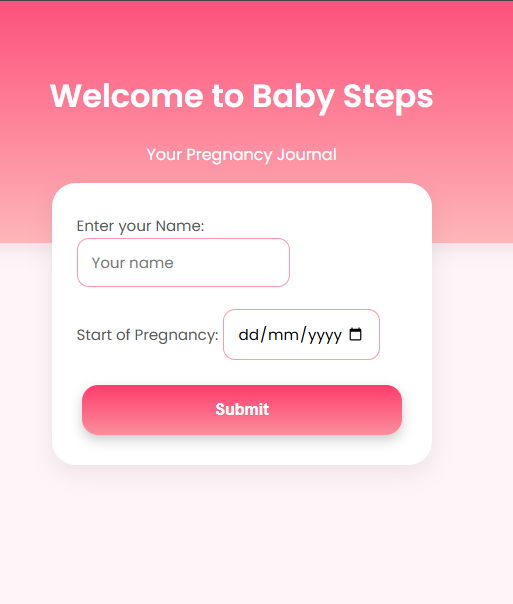
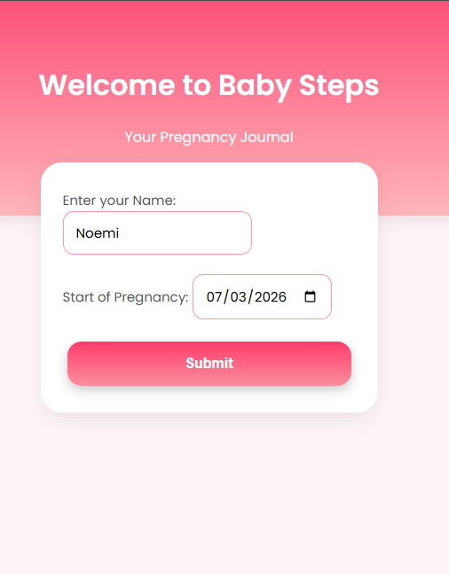
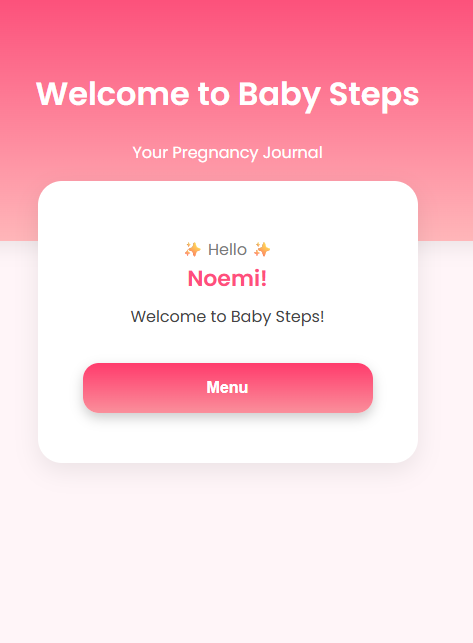
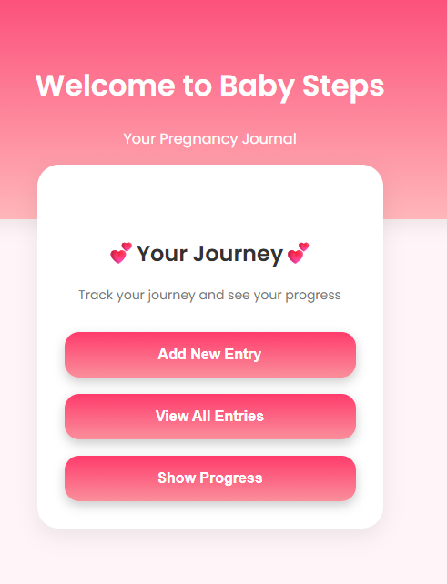
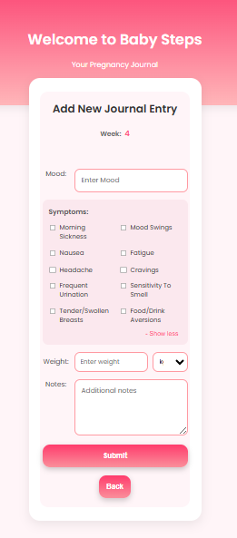
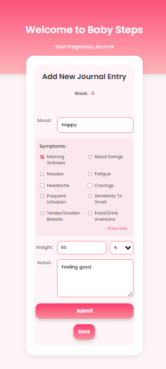
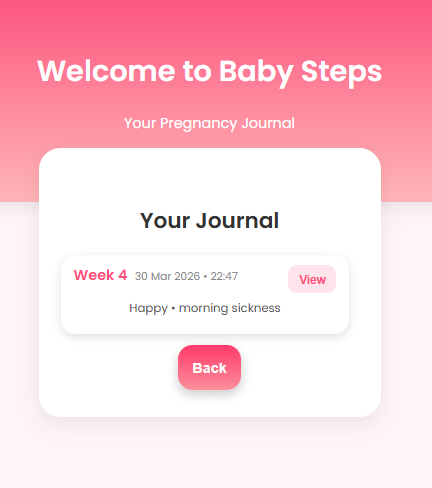
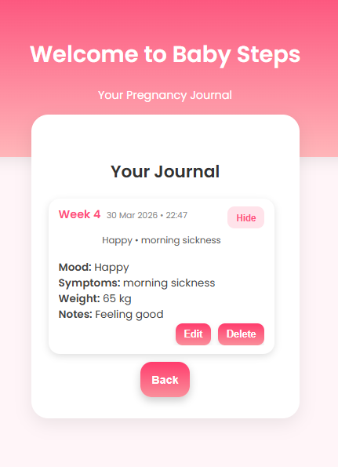
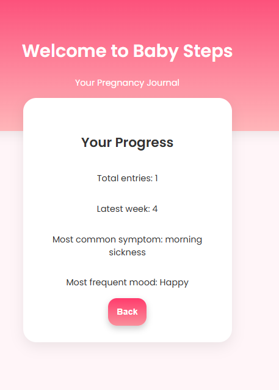

# Baby Steps

Baby Steps is a web-based pregnancy journal that enables users to track their progress through weekly entries.  
It provides a simple interface to record mood, symptoms, weight, and notes, and to review changes over time.

## ✨ Features

- Personalised user setup (name, start date, weight unit)
- Automatic pregnancy week calculation
- Add, edit, and delete journal entries
- Track:
  - Mood
  - Symptoms
  - Weight
  - Notes
- Expandable entry view for better readability
- Progress overview including:
  - Latest week reached
  - Most common symptom
  - Most frequent mood
- Clean and responsive UI

---

## 📸 Screenshots

### Welcome Screen





### Greeting



### Menu



### Add Entry




### Journal





### Progress



## 🛠️ Tech Stack

- **Backend:** Python, Flask, Flask-SQLAlchemy  
- **Frontend:** HTML, CSS, JavaScript  
- **Database:** SQLite (local)

---

## 🚀 Getting Started

### 1. Clone the repository

```bash
git clone https://github.com/Noemi-Condemi/baby_steps.git
cd baby_steps
```

### 2. Create a virtual environment

```bash
python -m venv .venv
.venv\Scripts\activate
```

### 3. Install dependencies

```bash
pip install flask flask_sqlalchemy
```

### 4. Run the application

```bash
python app.py
```

Open in your browser:
http://127.0.0.1:5000

## 📌 Notes

- The database file is not included in the repository  
- A new database will be created automatically on first run  
- Data is stored locally on the user's machine  

## 🎯 Future Improvements

- Week → Day → Entry structure for better navigation  
- Charts for progress visualisation  
- User authentication  
- Mobile-first optimisation  

## 👩‍💻 Author

Noemi Condemi
